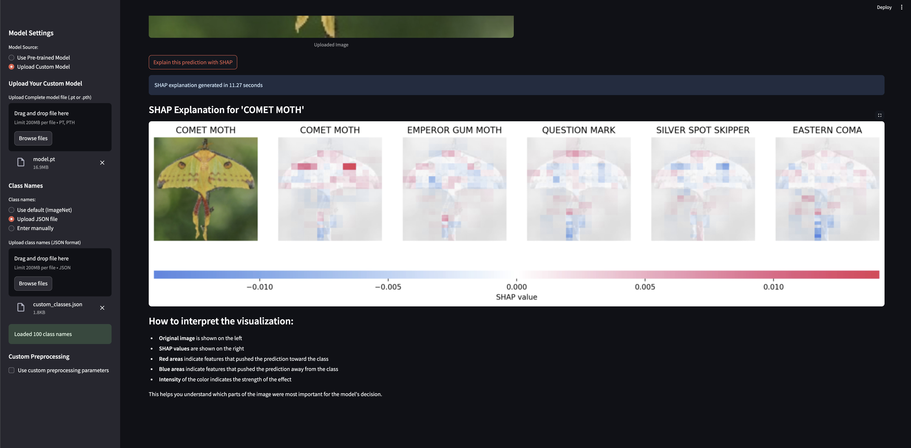

# ShapVision

ShapVision is a tool designed to explain image classification predictions using SHAP (SHapley Additive exPlanations). It supports both pre-trained models and custom PyTorch models, providing insights into how models make decisions by highlighting important features in the input image.

## Features

- Explain predictions of pre-trained models like ResNet18, MobileNetV2, and VGG16.
- Support for custom PyTorch models.
- Visualize SHAP values to understand model decisions.
- Customizable preprocessing and class label configurations.

## Prerequisites

Ensure you have the following installed:

- Python 3.8+
- PyTorch
- Streamlit
- SHAP
- Other dependencies listed in `requirements.txt`

## Installation

1. Clone the repository:
   ```bash
   git clone https://github.com/your-username/shapvision.git
   cd shapvision
   ```

2. Install dependencies:
   ```bash
   pip install -r requirements.txt
   ```

3. Update the Configuration in `globals.py`

## Usage

### Command-Line Interface

Run the explainer script directly to analyze an image:
```bash
python explanier.py --path <image_path> --device <device> --topk <top_k> --batch <batch_size> --nevals <num_evals>
```

Example:
```bash
python explanier.py --path ./assets/sample.jpg --device cpu --topk 3
```

### Web Application

Launch the Streamlit app for an interactive experience:
```bash
streamlit run app.py
```

1. Open the app in your browser (default: http://localhost:8501).
2. Select a pre-trained model or upload a custom model.
3. Upload an image to analyze.
4. View predictions and SHAP explanations.

#### Example Screenshot

Below is an example of the ShapVision app in action:



## License

This project is licensed under the MIT License. See the `LICENSE` file for details.

## Contact

For questions or support, please contact Chirag Juneja at [chiragjuneja6@gmail.com].
